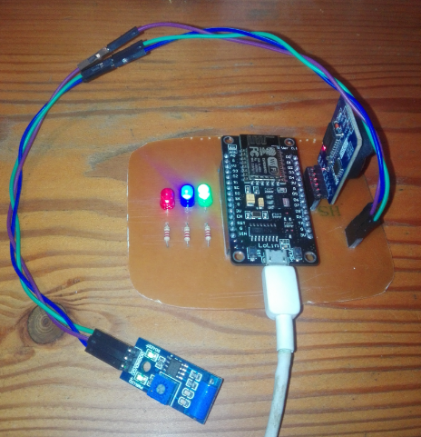

# SIUMESP

SiumESP is an Arduino client for MQTT using NODEMCU lolin. It is also part of the [SIUM project](https://github.com/rimegaray/proyectodsw).

## Depends on the following libraries:
- [PubSubClient](https://github.com/knolleary/pubsubclient)
- [RTC-Adafruit](https://github.com/adafruit/RTClib)
- [ESP8266](https://github.com/esp8266/Arduino)

## Additional boards Manager:
- [http://arduino.esp8266.com/stable/package_esp8266com_index.json](http://arduino.esp8266.com/stable/package_esp8266com_index.json)

## Hardware
- Nodemcu
- DS3231
- SW 420

<h1 align = "center">
  
</h1>
